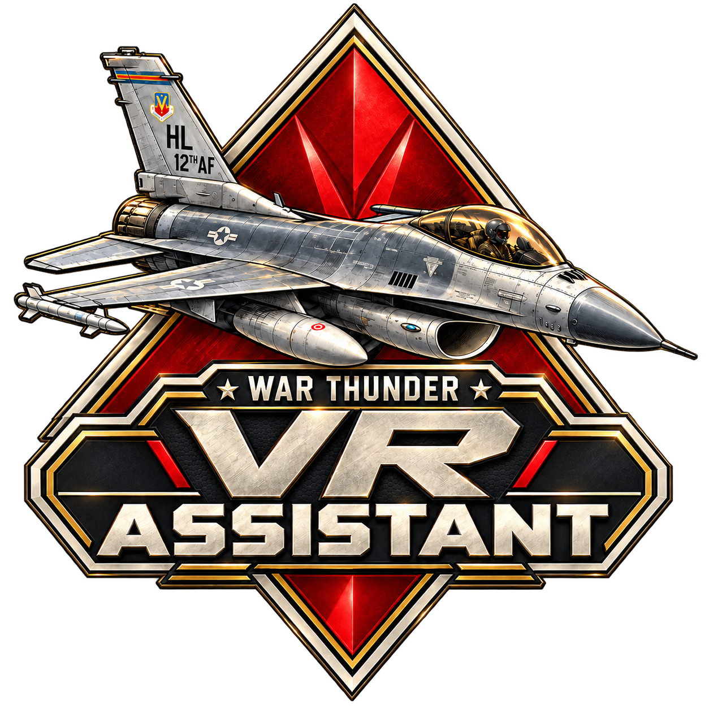

# War Thunder VR Settings Assistant 2.0

**WT VR Settings Assistant** is a companion application for **War Thunder**, designed primarily for VR, HOTAS, and Simulator Battle players.

It combines graphics/profile management, aircraft-specific control profiles, virtual trimming, flight assistance, keybind management, Neck Assistant functionality, and other VR-focused tools into a single application.

> **WT VR Settings Assistant is an independent community project and is not affiliated with, endorsed by, or supported by Gaijin Entertainment.**

---

# 🚀 What's New in Version 2.0

Version 2.0 is a major redesign and expansion of WT VR Settings Assistant.

The update introduces:

* ✈️ Aircraft-specific profiles
* 🔥 Integrated VTrim
* 🛩️ Flight Assistant
* 📈 Custom axis curves
* 🎮 Improved HOTAS/device management
* 🎛️ Improved Keybind Assistant
* 🥽 Improved Neck Assistant
* 🖥️ Monitor/Desktop and VR profile selection
* ⭐ Aircraft favorites
* 🔎 Aircraft search and filtering
* 🎨 Completely redesigned interface
* 🛠️ Major reliability and usability improvements

---

# 🖥️ Main Interface

The Home screen has been redesigned around a War Thunder-inspired interface.

The new Home screen provides quick access to:

* Monitor/Desktop configuration
* VR configuration
* Neck Assistant
* Keybind Assistant
* VTrim
* Aircraft Profiles
* Game launching
* Server selection
* Control/keybind profile selection

Optional aircraft/profile interface elements can also be hidden from **App Options** if you prefer a simpler Home screen.

---

# ✈️ Aircraft Profiles

Version 2.0 introduces dedicated **Aircraft Profiles**.

Instead of using one VTrim/control configuration for every aircraft, individual aircraft can now have their own settings.

Aircraft profiles can contain aircraft-specific settings such as:

* Axis curves
* Trim behavior
* Control response configuration
* Flight Assistant configuration
* Other aircraft-specific VTrim settings

## Aircraft Browser

Aircraft can be found using:

* 🔎 Name search
* 🌍 Nation filters
* ✈️ Aircraft type filters
* ⭐ Favorites

Aircraft categories include:

* Jets
* Propeller aircraft
* Helicopters

Aircraft cards use War Thunder-style presentation with aircraft imagery and dedicated Premium aircraft styling.

---

# ⭐ Favorites

Aircraft can be added to your Favorites for faster access.

You can:

* Add an aircraft to Favorites
* Remove an aircraft from Favorites
* Display Favorites only
* Identify favorites using the ⭐ indicator

Favorites do not create profiles automatically.

---

# 📋 Creating Aircraft Profiles

Profiles are created from the dedicated **Profiles** section.

1. Open **VTrim → Profiles**
2. Select **Add Profile**
3. Search for your aircraft
4. Select the correct aircraft
5. Create the profile

The aircraft name is used directly as the profile name.

This avoids having separate custom names that are not linked to the actual aircraft.

---

# 🧬 Clone Aircraft Profile

If several aircraft use similar controls, you do not need to configure everything again.

The **Clone** function allows you to copy the settings from one aircraft profile to another.

For example:

`F-16C → F-16A`

or

`AH-64D → AH-64A`

Select the destination aircraft using the normal aircraft picker.

If the destination aircraft already has a profile, WT VR Settings Assistant will warn you before replacing it.

---

# 🔥 VTrim — Virtual Trim

VTrim is now integrated directly into WT VR Settings Assistant.

It provides software-based trim controls intended primarily for HOTAS users.

VTrim contains four main sections:

### Trim Dashboard

Control and monitor your current trim state.

### Devices & Output

Configure your physical controls and virtual output.

### Axis Curves

Configure response curves, deadzones, and input/output ranges.

### Profiles

Manage aircraft-specific VTrim configurations.

---

# 🎮 VTrim Controls

VTrim supports independent trim controls for:

### Pitch

* Nose Up
* Nose Down

### Roll

* Roll Left
* Roll Right

### Rudder

* Rudder Left
* Rudder Right

Additional controls include:

* **Store Trim**
* **CENTER ALL**
* Flight Assistant toggle
* Trim sensitivity
* Manual trim adjustment

All of these functions can be assigned to supported keyboard/HOTAS inputs.

---

# 💾 Store Trim

**Store Trim** allows you to physically position your controls and capture that position as the new trim reference.

The Version 2.0 Store Trim system captures the complete current control command, including existing:

* Pitch trim
* Roll trim
* Rudder trim

Store Trim rebases from your current physical controls rather than incorrectly carrying previous trim offsets forward.

This makes it possible to establish a new trimmed control position quickly while flying.

---

# 🎯 CENTER ALL

**CENTER ALL** immediately resets VTrim offsets for:

* Pitch
* Roll
* Rudder

Flight Assistant operates independently from CENTER ALL, so resetting your trim does not automatically change the Flight Assistant state.

---

# 📈 Axis Curves

VTrim includes a dedicated Axis Curves system.

Each supported axis can be configured with:

* Response curve
* Deadzone
* Input range
* Output range
* Individual axis reset

This allows you to customize how your physical HOTAS controls translate into virtual aircraft controls.

Aircraft-specific curves can be stored in individual aircraft profiles.

---

# 🎮 Physical HOTAS Input

VTrim is designed so that your HOTAS continues to behave normally.

Physical buttons remain **native inputs** unless you explicitly assign them to a VTrim function.

This means VTrim does not unnecessarily intercept unrelated HOTAS buttons.

Physical device routing is universal to the application where appropriate, so you do not need to configure your physical HOTAS again for every aircraft.

---

# 🕹️ vJoy

VTrim uses **vJoy Device 1** for virtual control output.

Virtual output is available for:

* Roll
* Pitch
* Rudder

WT VR Settings Assistant includes:

* One-click vJoy setup/connect flow
* Automatic connection option
* Connection status monitoring
* Automatic retry handling
* Reconnection handling
* Output failure protection

The application also includes safeguards designed to prevent disconnected physical devices from leaving old control offsets stuck on virtual output.

---

# 🛩️ Flight Assistant

The previous **Instructor** system has been replaced by the new **Flight Assistant**.

Flight Assistant provides configurable stabilization and correction while preserving physical control input.

It is particularly intended to complement HOTAS flying and VTrim.

---

## ⬆️ Pitch Assistance

Flight Assistant can provide:

* Pitch attitude hold
* Pitch dampening
* Maximum Elevator correction
* Physical Pitch center deadzone
* Smoothing/response control
* Correction aggressiveness

---

## ↔️ Roll Assistance

Optional Roll Assist can provide wings-level correction.

Available settings include:

* Roll Assist
* Maximum Aileron correction
* Roll center deadzone

---

## 🦶 Rudder Assistance

Optional Rudder Assist can help reduce sideslip.

Available settings include:

* Rudder Assist
* Maximum Rudder correction
* Pedal center deadzone

---

# 📡 Telemetry

Where suitable telemetry is available, Flight Assistant can use War Thunder telemetry information when calculating assistance.

The system also includes fallback/standby behavior when:

* Telemetry is unavailable
* Telemetry becomes stale
* Airspeed is too low
* Available data is unsuitable for reliable correction

Flight Assistant status and correction behavior can be monitored directly from the application.

---

# 🎛️ Keybind Assistant

Keybind Assistant provides additional control-management functionality for War Thunder.

Version 2.0 integrates keybind profile selection directly into the Home screen.

Separate selectors are available for:

### 🖥️ Monitor / Desktop

Select a control profile intended for normal monitor/desktop gameplay.

### 🥽 VR / HOTAS

Select a control profile intended for your VR/HOTAS setup.

Available profiles can be selected directly from the corresponding Home screen card.

---

# 🚫 No Profile

Selecting:

**No Profile**

tells WT VR Settings Assistant not to apply a control profile.

This allows you to keep your existing War Thunder controls untouched.

Home screen keybind selectors can also be hidden completely from **App Options**.

---

# 🥽 Neck Assistant

Neck Assistant provides additional VR head/camera functionality intended to make looking around the cockpit and environment more comfortable.

Version 2.0 improves:

* Interface readability
* Control accessibility
* Keybind handling

A dedicated **Recenter Neck Assistant** action can now be assigned to:

* Keyboard
* HOTAS
* Other supported input devices

---

# ⚙️ Universal vs Aircraft-Specific Settings

Version 2.0 separates settings based on whether they should belong to your hardware or to an individual aircraft.

## Universal Settings

Settings such as physical axis/device routing are universal where appropriate.

This prevents you from having to configure the same HOTAS repeatedly for every aircraft.

## Aircraft-Specific Settings

Settings that benefit from individual tuning remain associated with aircraft profiles.

Examples include:

* Axis curves
* Aircraft trim behavior
* Aircraft-specific Flight Assistant settings
* Other aircraft-specific VTrim configuration

This allows, for example, a helicopter, propeller aircraft, and modern jet to use completely different control characteristics.

---

# 💾 Profile & Settings Storage

Profiles are stored locally as normal **JSON files** inside the application's settings directory.

WT VR Settings Assistant does not require an online account for aircraft profile storage.

Version 2.0 also includes compatibility/migration handling for older settings.

When updating the application, your existing settings/profile data can be preserved.

> It is always recommended to make a backup of your settings/profile folder before replacing or updating an existing installation.

---

# 🆕 Clean First Run

Fresh installations of Version 2.0 start clean.

The release does not intentionally include development/test:

* Aircraft profiles
* Personal profiles
* Personal keybinds
* User-specific configuration

You can therefore configure the application specifically for your own hardware and War Thunder setup.

---

# 🖥️ Monitor & VR Configuration

WT VR Settings Assistant is designed to make switching between normal monitor gameplay and VR easier.

The Home screen provides dedicated **Monitor** and **VR** configuration cards.

This allows you to maintain separate configurations for different ways of playing War Thunder without repeatedly changing everything manually.

---

# 🎨 Graphics & VR Settings

WT VR Settings Assistant can help manage War Thunder graphics configurations for different play modes.

This is useful when your preferred:

**Monitor settings**

are significantly different from your:

**VR settings**

For example, VR may require different:

* Resolution/scaling settings
* Anti-aliasing/upscaling configuration
* Graphics quality
* Performance settings
* VR-specific options

The Assistant is designed to make switching between these configurations considerably faster.

---

# 🚀 Launching War Thunder

WT VR Settings Assistant can be used as your launch point for War Thunder.

Configure the required game location/settings inside the application and use the main **PLAY** control to launch the game using your selected configuration.

---

# 🔄 Updating WT VR Settings Assistant

When installing a newer build:

1. Close WT VR Settings Assistant.
2. Back up your existing settings/profile data if desired.
3. Install/extract the new application build.
4. Start WT VR Settings Assistant.
5. Verify your profiles and device configuration.

Version 2.0 includes compatibility handling for older settings where supported.

---

# 🛠️ Troubleshooting

If VTrim is not producing output:

1. Open **VTrim → Devices & Output**
2. Confirm your physical HOTAS is detected.
3. Confirm the correct physical axes are selected.
4. Confirm vJoy is available.
5. Confirm VTrim is connected to **vJoy Device 1**.
6. Check the live axis monitors.
7. Verify that War Thunder is configured to use the appropriate virtual axes.

If Flight Assistant is not applying corrections, verify that:

* VTrim output is functioning
* The relevant Flight Assistant functions are enabled
* Your center deadzones are configured correctly
* Required telemetry is available
* The aircraft is in a suitable flight state

---

# 📦 Requirements

WT VR Settings Assistant is designed for Windows systems running War Thunder.

Depending on the features you use, you may require:

* Windows 10/11
* War Thunder
* OpenXR/SteamVR or another supported VR runtime for VR gameplay
* HOTAS/joystick hardware for HOTAS-specific features
* vJoy for VTrim virtual axis output

You do **not** need to use every Assistant module.

For example, you can use the graphics/profile functionality without using VTrim or Flight Assistant.

---

# ❤️ Support the Project

WT VR Settings Assistant is developed as a community project for War Thunder players.

If the application helps improve your War Thunder/VR experience, you can support the project or follow development here:

### 🍺 Buy Me a Beer / Donate

https://www.paypal.com/donate/?business=SLS9FP9VALFV4&no_recurring=1&item_name=Thank+you+for+supporting+what+I+do%21&currency_code=EUR

### ▶️ YouTube

https://www.youtube.com/@SPYBGWTVR?sub_confirmation=1

### 💬 Discord

https://discord.com/invite/eXWbS3WExB

Bug reports, suggestions, testing feedback, and feature ideas are always appreciated.

---

# ⚠️ Disclaimer

WT VR Settings Assistant is an independent community-created application.

It is **not affiliated with, endorsed by, sponsored by, or officially supported by Gaijin Entertainment**.

**War Thunder**, its aircraft, imagery, names, trademarks, and related assets belong to their respective owners.

Use WT VR Settings Assistant at your own discretion.

Before making significant configuration changes, keeping backups of your War Thunder configuration and WT VR Settings Assistant profiles/settings is recommended.

---

# 📜 License

Please refer to the repository's license information for the licensing terms applicable to this project.

---

# ❤️ Thank You

Thank you to everyone who has:

* Tested WT VR Settings Assistant
* Reported bugs
* Suggested features
* Helped test VR/HOTAS configurations
* Provided aircraft feedback
* Supported development

A large part of Version 2.0 was shaped by feedback from people actively using the Assistant with **War Thunder, VR, HOTAS setups, and Simulator Battles**.

## Enjoy WT VR Settings Assistant 2.0! ✈️🥽
