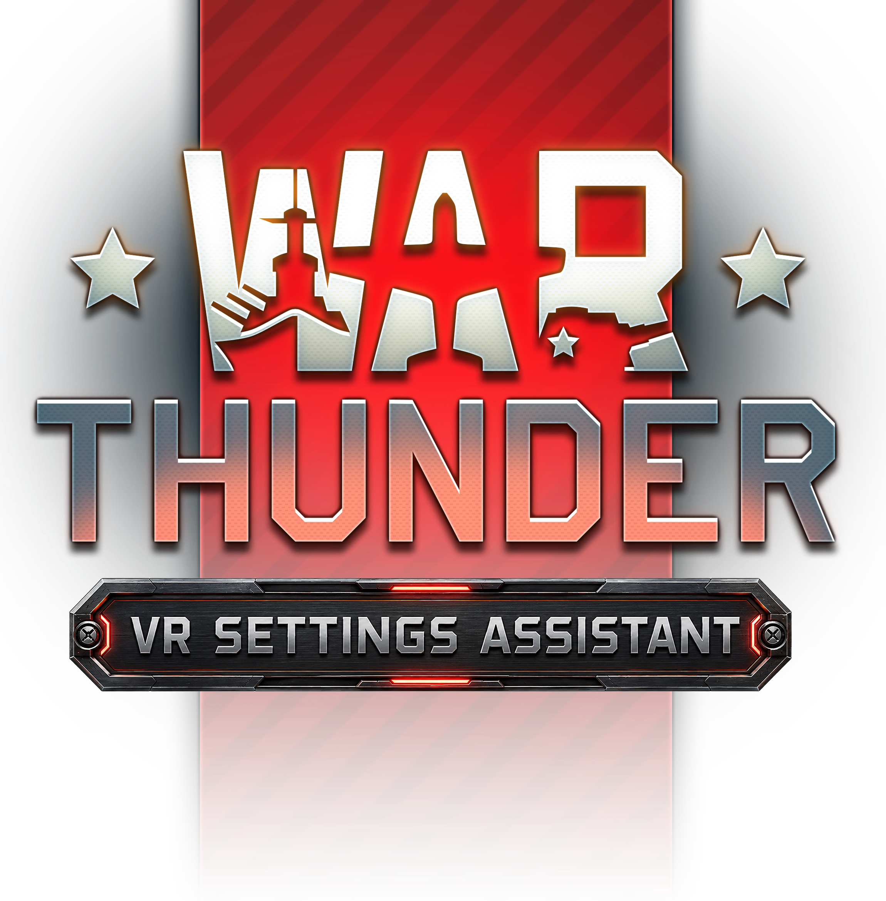

# War Thunder VR Settings Assistant

  

  A lightweight utility for managing War Thunder graphics settings for both Desktop and VR gameplay.

---

## Features

### Graphics Profile Management

* Switch between Desktop and VR graphics configurations
* Support for custom `.blk` files
* Built-in VR presets:

  * Low
  * Medium
  * High

### Settings Capture

* Capture your current War Thunder graphics settings directly from `config.blk`
* Save Desktop and VR configurations for quick access
* Easily remove or replace saved profiles

### Easy Configuration

* Browse or drag-and-drop `.blk` files
* One-click profile switching
* Simple and intuitive interface

### Recommended Settings Guide

* Interactive setup guide for:

  * Virtual Desktop
  * Meta Quest
  * SteamVR

### Extras

* Built-in help and recommendation tools
* Fun hidden easter eggs

---

## Requirements

* Windows 10 / Windows 11
* War Thunder
* .NET Desktop Runtime (if required by your release build)

---

## How To Use

1. Locate your War Thunder `config.blk`
2. Configure your Desktop and/or VR profile
3. Choose a preset or custom `.blk`
4. Apply the desired settings
5. Launch War Thunder

---

## Disclaimer

This is an unofficial community-made tool and is not affiliated with, endorsed by, or sponsored by Gaijin Entertainment.

War Thunder is a trademark of Gaijin Entertainment.

Always keep a backup of your original `config.blk` before modifying graphics settings.

---

## License

MIT License
